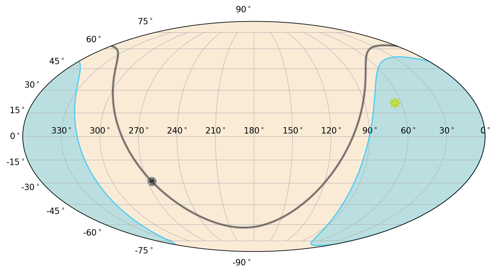
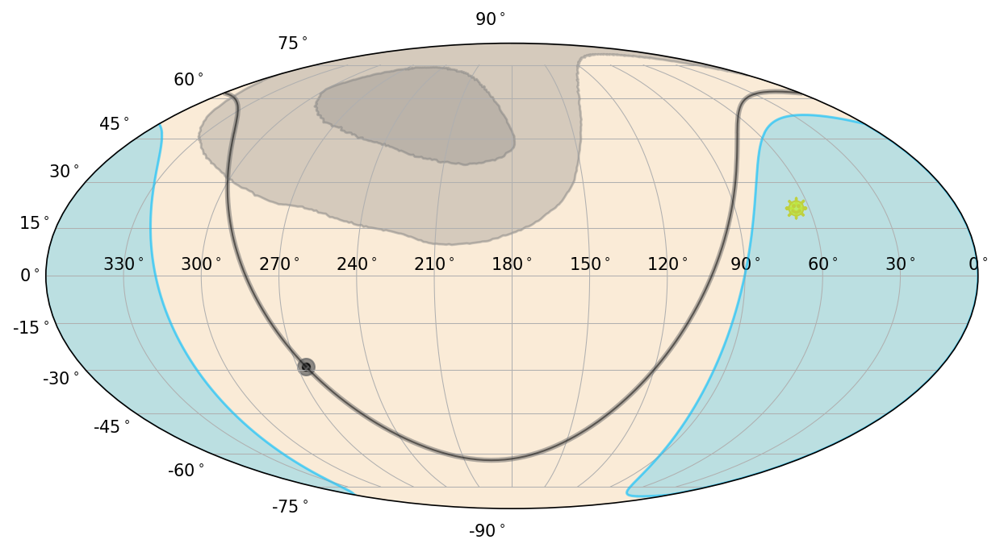

.. _bat-detector:
.. |BatPartialCoding| replace:: :class:`~gdt.missions.swift.bat.detectors.BatPartialCoding`
.. |SwiftSao| replace:: :class:`~gdt.missions.swift.poshist.SwiftSao`
.. |EquatorialPlot| replace:: :class:`~gdt.core.plot.sky.EquatorialPlot`

************************************************************************
Swift BAT Detector Definitions (:mod:`gdt.missions.swift.bat.detectors`)
************************************************************************
The |BatPartialCoding| class contains the partial coding information of the 
Swift BAT instrument, which defines the field of view (FOV) as a function of the 
partial coding fraction. 

We can initialize this object in the following way:

    >>> from gdt.missions.swift.bat.detectors import BatPartialCoding
    >>> bat = BatPartialCoding()
    >>> print(bat)
    <BatPartialCoding: NSIDE=128>
    
The partial coding fraction is stored in the object as a HEALPix array with a
default NSIDE resolution of 128.   
    
There are a number of things we can do with this object.  For example, say we
want to know the partial coding at a particular position.  Since we just loaded
up the object, the coordinate frame is in instrument coordinates (azimuth, 
zenith), where zenith=0 is the direction of the BAT boresight.

    >>> # partial coding fraction at the boresight
    >>> bat.partial_coding(0.0, 0.0)
    1.0
    
    >>> # partial coding coding at zenith=30 deg
    >>> bat.partial_coding(0.0, 30.0)
    0.48824766278266907

We can determine the area contained within a given partial coding fraction:

    >>> # area of 90% partial coding (in sq. deg.)
    >>> bat.area(0.9)
    1639.140489097409
    
    >>> # area of 50% partial coding (in sq. deg.)
    >>> bat.area(0.5)
    4384.470002583136

One of the most useful things we can do is determine the BAT FOV on the sky at
a given time.  To do this, we need to rotate the BAT FOV from the instrument
frame to the celestial frame.  For this operation, we will use the |SwiftSao|
class, which contains the Swift position and attitude history information for 
an observation (see :ref:`Swift Position/Attitude History Data<bat-poshist>` 
for more information).

    >>> from gdt.core import data_path
    >>> from gdt.missions.swift.poshist import SwiftSao
    >>> filepath = data_path / 'swift-bat' / 'sw00974827000sao.fits.gz'
    >>> sao = SwiftSao.open(filepath)
    
From the SAO file, we retrieve the spacecraft frames:

    >>> frames = sao.get_spacecraft_frame()
    frames
    <SpacecraftFrame: 2162 frames;
     obstime=[612353536.6006, ...]
     obsgeoloc=[(-6165602., -2728582.2, 1604040.5) m, ...]
     obsgeovel=[(3400.097, -6478.7993, 2006.0916) m / s, ...]
     quaternion=[(x, y, z, w) [-0.35197902, -0.34436679, -0.75078022,  0.44028553], ...]>

As we can see, this is a series of 2,162 frames as a function of time.  Each
frame contains information, such as the position, velocity, and rotation of the
Swift spacecraft.

Let's choose the first frame and rotate our BAT partial coding object using that
frame:

    >>> bat_rot = bat.rotate(frames[0])

Now, ``bat_rot`` has been rotated to the celestial frame, and hence when we input
coordinates, they should represent RA and Dec instead of Azimuth and Zenith:

    >>> # partial coding at RA=230, Dec=60
    >>> bat_rot.partial_coding(230.0, 60.0)
    0.999921551147817

    >>> # partial coding at RA=180, Dec=30
    >>> bat_rot.partial_coding(180.0, 30.0)
    0.676047909711115
    
We can see that the center of the BAT FOV is close to RA=230, Dec=60. To make it
easy to view were the FOV is on the sky, we can plot the BAT FOV corresponding
to a given partial coding fraction using |EquatorialPlot|.

First, let's initialize the plot and the spacecraft frame that we are using. 
This allows us to see where the Sun and the Earth is on the sky:

    >>> import matplotlib.pyplot as plt
    >>> from gdt.core.plot.sky import EquatorialPlot
    >>> eqplot = EquatorialPlot(interactive=True)
    >>> eqplot.add_frame(frames[0], detectors=[])
    >>> plt.show()

Note that we set ``detectors`` to an empty list because we are going to plot the
detector area separately.  In this figure, you see the Galactic Plane (gray), 
the sun (yellow), and the region of the sky occulted by the Earth (blue).

Now we can add the BAT FOV.  Let's plot both the 90% and 10% partial coded
regions.

    >>> bat_poly90 = bat_rot.plot_polygon(0.9, eqplot)
    >>> bat_poly10 = bat_rot.plot_polygon(0.1, eqplot)

The light gray regions now mark the BAT FOV for 90% and 10% partial coding.

Reference/API
=============

.. automodapi:: gdt.missions.swift.bat.detectors
   :inherited-members:

