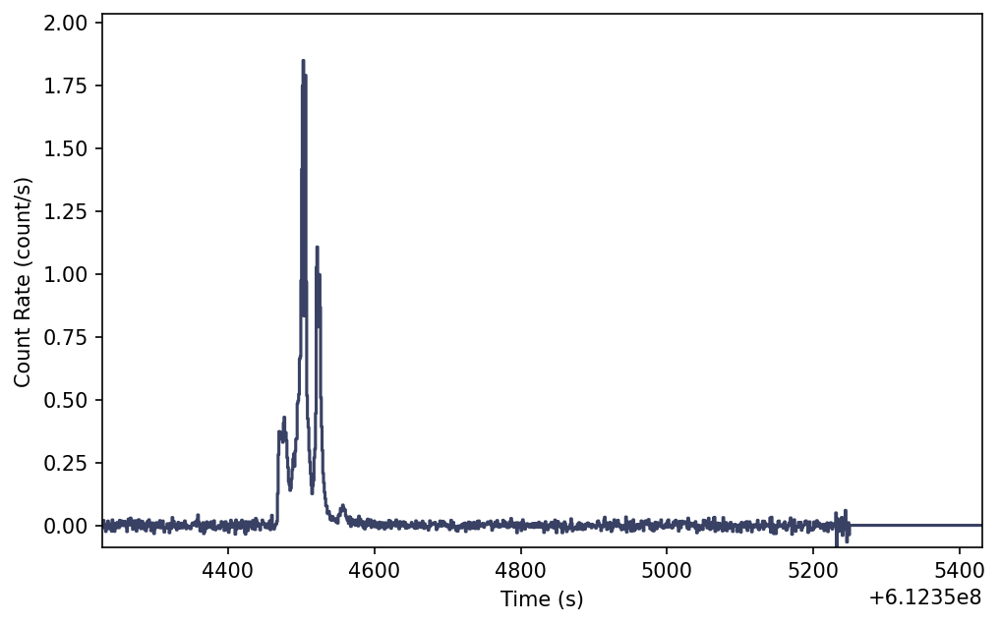
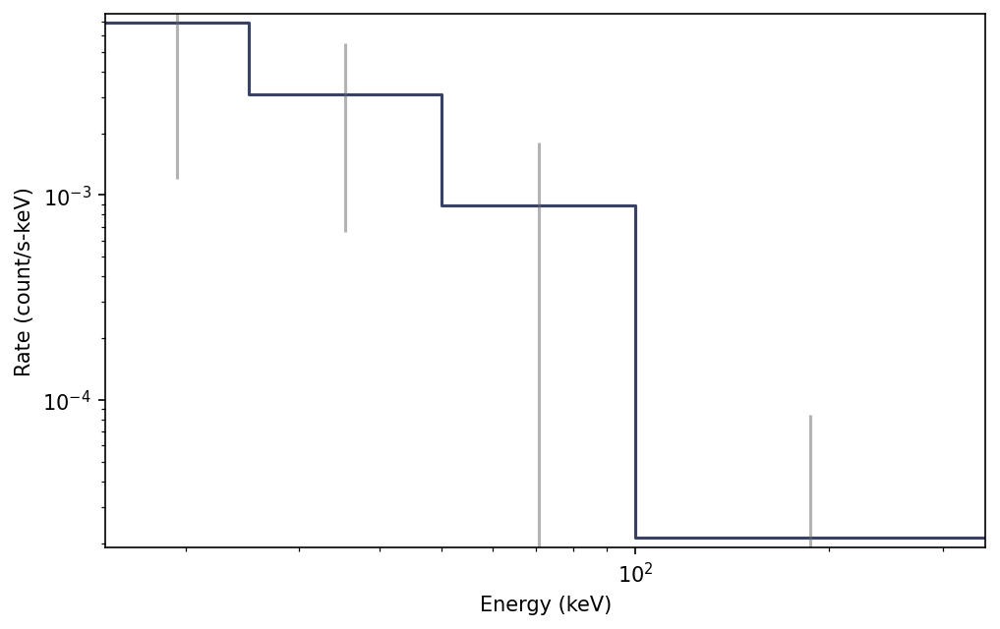
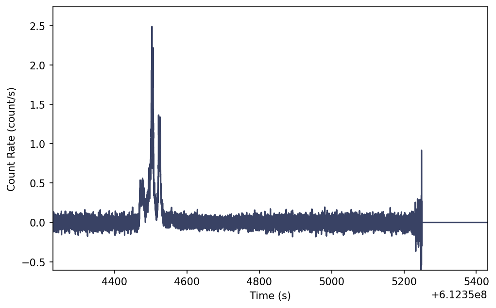
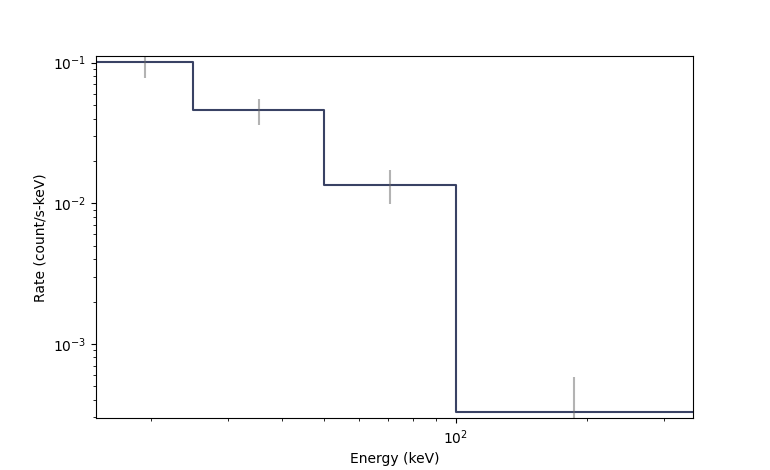

.. _bat-lightcurve:
.. |BatLightcurve| replace:: :class:`~gdt.missions.swift.bat.lightcurve.BatLightcurve`
.. |TimeEnergyBins| replace:: :class:`~gdt.core.data_primitives.TimeEnergyBins`
.. |TimeBins| replace:: :class:`~gdt.core.data_primitives.TimeBins`
.. |EnergyBins| replace:: :class:`~gdt.core.data_primitives.EnergyBins`
.. |Phaii| replace:: :class:`~gdt.core.phaii.Phaii`
.. |Lightcurve| replace:: :class:`~gdt.plot.lightcurve.Lightcurve`
.. |Spectrum| replace:: :class:`~gdt.plot.spectrum.Spectrum`

**********************************************************
Swift Bat Lightcurve Data (:mod:`gdt.missions.swift.bat.lightcurve`)
**********************************************************
The science data produced by BAT can be summarized as a time history of
spectra, which is provided temporally pre-binned (1 s and 64 ms).
These data types are produced as "snippets" for
every single GRB. One of the most common things that a user of BAT data wants to do is
look at this data (what we call a lightcurve) over
some energy range.

The data are pre-binned data with 64 ms and 1 ms binning and which have 4
energy channels. These data files can be read by the |BatLightcurve|
class.

    >>> from gdt.core import data_path
    >>> from gdt.missions.swift.bat.lightcurve import BatLightcurve
    >>> # read a 1s file
    >>> filepath = data_path.joinpath('swift-bat/sw00974827000bev1s.lc')
    >>> file = BatLightcurve.open(filepath)
    >>> file
    <BatLightcurve: sw00974827000bev1s.lc.gz;
      trigger time: 612354468.864;
      time range (612354228.5, 612355431.5);
      energy range (15.0, 350.0)>

Since BAT uses the FITS format, the data files have multiple data extensions,
each with metadata information in a header. There is also a primary header that
contains metadata relevant to the overall file. You can access this metadata
information:

    >>> file.headers.keys()
    ['PRIMARY', 'RATE', 'EBOUNDS', 'STDGTI']

    >>> file.headers['PRIMARY']
    TELESCOP= 'SWIFT   '           / Telescope (mission) name
    INSTRUME= 'BAT     '           /  Instrument name
    OBS_ID  = '00974827000'        / Observation ID
    TARG_ID =               974827 / Target ID
    SEG_NUM =                    0 / Segment number
    TIMESYS = 'TT      '           / time system
    MJDREFI =                51910 / MJD reference day Jan 2001 00:00:00
    MJDREFF = '0.00074287037'      / MJD reference (fraction of day) 01 Jan 2001 00:
    CLOCKAPP= 'False   '           / If clock correction are applied (F/T)
    TIMEUNIT= 's       '           / Time unit for timing header keywords
    TSTART  =          612354229.0 / As in the TIME column
    TSTOP   =       612355431.1402 / As in the TIME column
    DATE-OBS= '2020-05-28T10:23:44'
    DATE-END= '2020-05-28T10:43:46'
    ORIGIN  = 'GSFC    '           / file creation location
    CREATOR = 'BAT2FITS V7.21'     / file creator
    TLM2FITS= 'V7.21   '           / Telemetry converter version number
    DATE    = '2020-06-07T06:31:25' / file creation date (YYYY-MM-DDThh:mm:ss UT)
    PROCVER = '3.18.11 '           / Processing script version
    SOFTVER = 'Hea_27Jul2015_V6.17_Swift_Rel4.5(Bld34)_27Jul2015_SDCpatch_16'
    CALDBVER= 'b20171016_u20170922_x20190910_m20200504' / CALDB index versions used
    SEQPNUM =                    6 / Number of times the dataset processed
    OBJECT  = 'GRB200528a'         / Object name
    RA_OBJ  =             176.6439 / [deg] R.A. Object
    DEC_OBJ =             58.19214 / [dec] Dec Object
    RA_PNT  =     176.681859056405 / [deg] RA pointing
    DEC_PNT =     58.1445301944316 / [deg] Dec pointing
    PA_PNT  =     298.735423901845 / [deg] Position angle (roll)
    TRIGTIME=        612354468.864 / MET TRIGger Time for Automatic Target
    CATSRC  = 'False   '
    ATTFLAG =                  110 / Attitude origin: 100=sat/spacecraft
    UTCFINIT= '-25.0171'           / [s] UTCF at TSTART
    CHECKSUM= 'YhbmYeZkYebkYeZk'   / HDU checksum updated 2020-06-07T06:49:01
    DATASUM = '         0'         / data unit checksum updated 2020-06-07T06:32:34

There is easy access for certain important properties of the data:

    >>> # the good time intervals for the data
    >>> file.gti
    <Gti: 1 intervals; range (-239.8639999628067, 962.276200056076)>

    >>> # the trigger time
    >>> file.trigtime
    612354468.864

    >>> # the time range
    >>> file.time_range
    (612354228.5, 612355431.5)

    >>> # the energy range
    >>> file.energy_range
    (15.0, 350.0)

    >>> # number of energy channels
    >>> file.num_chans
    4

We can retrieve the time history spectra data contained within the file, which
is a |TimeEnergyBins| class (see
:external:ref:`2D Binned Data<core-data_primitives-2d>` for more details).

    >>> file.data
    <TimeEnergyBins: 1203 time bins;
    time range (612354228.5, 612355431.5);
    1 time segments;
    4 energy bins;
    energy range (15.0, 350.0);
    1 energy segments>

Through the |Phaii| base class, there are a lot of high level functions
available to us, such as slicing the data in time or energy:

    >>> time_sliced = file.slice_time((file.trigtime-10.0, file.trigtime+10.0))
    >>> time_sliced
    <BatLightcurve:
    trigger time: 612354468.864;
    time range (612354458.5, 612354479.5);
    energy range (15.0, 350.0)>

    >>> energy_sliced = file.slice_energy((50.0, 100.0))
    >>> energy_sliced
    <BatLightcurve:
    trigger time: 612354468.864;
    time range (612354228.5, 612355431.5);
    energy range (50.0, 100.0)>

As mentioned, this data is 2-dimensional, so what do we do if we want a
lightcurve covering a particular energy range? We integrate (sum) over energy,
and we can easily do this:

    >>> lightcurve = file.to_lightcurve(energy_range=(15.0, 350.0))
    >>> lightcurve
    <TimeBins: 1203 bins;
    range (612354228.5, 612355431.5);
    1 contiguous segments>

Similarly, we can integrate over time to produce a count spectrum:

    >>> spectrum = file.to_spectrum(time_range=(file.trigtime-10.0, file.trigtime+10.0))
    >>> spectrum
    <EnergyBins: 4 bins;
    range (15.0, 350.0);
    1 contiguous segments>

The resulting objects are |TimeBins| and |EnergyBins|, respectively, and see
:external:ref:`1D Binned Data<core-data_primitives-1d>` for more details on how
to use them.

Of course, once we have produced a lightcurve or spectrum data object, often
we want to plot it.  For that, we use the |Lightcurve| and |Spectrum| plotting
classes:

    >>> import matplotlib.pyplot as plt
    >>> from gdt.core.plot.lightcurve import Lightcurve
    >>> lcplot = Lightcurve(data=lightcurve)
    >>> plt.show()

Similarly, we can plot the count spectrum:

    >>> from gdt.plot.spectrum import Spectrum
    >>> specplot = Spectrum(data=spectrum)
    >>> plt.show()

See :external:ref:`Plotting Lightcurves<plot-lightcurve>` and
:external:ref:`Plotting Count Spectra<plot-spectrum>` for more on
how to modify these plots.

Finally, we can write out a new fully-qualified lightcurve FITS file after some
reduction tasks.  For example, we can write out our time-sliced data object:

    >>> time_sliced.write('./', filename='my_first_custom_lightcurve.lc')

We can also view the 64 ms binning lightcurve file with similar steps.

    >>> from gdt.core import data_path
    >>> from gdt.missions.swift.bat.lightcurve import BatLightcurve
    >>> # read a 1s file
    >>> filepath = data_path.joinpath('swift-bat/sw00974827000bevms.lc')
    >>> file = BatLightcurve.open(filepath)
    >>> lightcurve = file.to_lightcurve(energy_range=(15.0, 350.0))
    >>> lcplot = Lightcurve(data=lightcurve)
    >>> plt.show()

Similarly, we can plot the count spectrum:

    >>> from gdt.plot.spectrum import Spectrum
    >>> specplot = Spectrum(data=spectrum)
    >>> plt.show()

For more details about working with PHAII data, see
:external:ref:`PHAII Files<core-phaii>`.

Reference/API
=============

.. automodapi:: gdt.missions.swift.bat.phaii
   :inherited-members:
