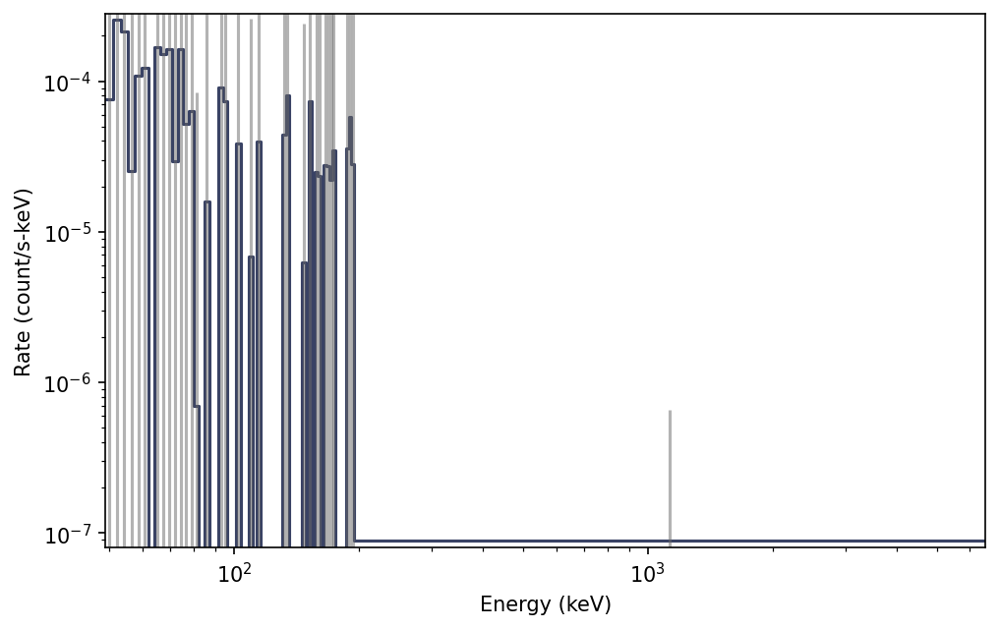

.. _bat-pha:
.. |batpha| replace:: :class:`~gdt.missions.swift.bat.pha.BatPha`
.. |TimeEnergyBins| replace:: :class:`~gdt.core.data_primitives.TimeEnergyBins`
.. |TimeBins| replace:: :class:`~gdt.core.data_primitives.TimeBins`
.. |EnergyBins| replace:: :class:`~gdt.core.data_primitives.EnergyBins`
.. |pha| replace:: :class:`~gdt.core.pha.Pha`
.. |Lightcurve| replace:: :class:`~gdt.plot.lightcurve.Lightcurve`
.. |Spectrum| replace:: :class:`~gdt.plot.spectrum.Spectrum`

******************************************************
Swift Bat PHA Data (:mod:`gdt.missions.swift.bat.pha`)
******************************************************
On of the science data produced by BAT is a PHA energy spectrum

The data are provided for pre-slew (ps), during slew (sl) and after-slew (as). These data files can be read by the |batpha|
class.

    >>> from gdt.core import data_path
    >>> from gdt.missions.swift.bat.pha import BatPha
    >>> # read a pha file
    >>> filepath = data_path.joinpath('swift-bat/sw00974827000bevas.pha.gz')
    >>> file = BatPha.open(filepath)
    >>> file
    <BatPha: sw00974827000bevas.pha;
    trigger time: 612354468.864;
    time range (69.73658001422882, 113.2039999961853);
    energy range (0.0, 6553.6)>

Since bat uses the FITS format, the data files have multiple data extensions,
each with metadata information in a header. There is also a primary header that
contains metadata relevant to the overall file. You can access this metadata
information:

    >>> file.headers.keys()
    ['PRIMARY', 'SPECTRUM', 'EBOUNDS', 'STDGTI']

    >>> file.headers['PRIMARY']
    TELESCOP= 'SWIFT   '           / Telescope (mission) name
    INSTRUME= 'BAT     '           /  Instrument name
    OBS_ID  = '00974827000'        / Observation ID
    TARG_ID =               974827 / Target ID
    SEG_NUM =                    0 / Segment number
    TIMESYS = 'TT      '           / time system
    MJDREFI =                51910 / MJD reference day Jan 2001 00:00:00
    MJDREFF = '0.00074287037'      / MJD reference (fraction of day) 01 Jan 2001 00:
    CLOCKAPP= 'False   '           / If clock correction are applied (F/T)
    TIMEUNIT= 's       '           / Time unit for timing header keywords
    TSTART  =      612354538.60058 / As in the TIME column
    TSTOP   =        612354582.068 / As in the TIME column
    DATE-OBS= '2020-05-28T10:28:53'
    DATE-END= '2020-05-28T10:29:37'
    ORIGIN  = 'NASA/GSFC'          / file creation location
    CREATOR = 'extractor v5.24'    / file creator
    TLM2FITS= 'V7.21   '           / Telemetry converter version number
    DATE    = '2020-06-07T06:39:30' / file creation date (YYYY-MM-DDThh:mm:ss UT)
    NEVENTS =              1754792 / Number of events
    DATAMODE= 'Event   '           / Datamode
    OBJECT  = 'GRB200528a'         / Object name
    MJD-OBS =    58997.43753222893 / MJD of data start time
    TIMEREF = 'LOCAL   '           / reference time
    EQUINOX =               2000.0 / Equinox for pointing RA/Dec
    RADECSYS= 'FK5     '           / Coordinates System
    USER    = 'apsop   '           / User name of creator
    FILIN001= 'sw00974827000bevshsp_uf.evt' / Input file name
    TIMEZERO=                  0.0 / Time Zero
    CHECKSUM= '5F5HAE5F6E5FAE5F'   / HDU checksum updated 2020-06-07T06:49:01
    DATASUM = '         0'         / data unit checksum updated 2020-06-07T06:32:34
    PROCVER = '3.18.11 '           / Processing script version
    SOFTVER = 'Hea_27Jul2015_V6.17_Swift_Rel4.5(Bld34)_27Jul2015_SDCpatch_16'
    CALDBVER= 'b20171016_u20170922_x20190910_m20200504' / CALDB index versions used
    SEQPNUM =                    6 / Number of times the dataset processed
    RA_OBJ  =             176.6439 / [deg] R.A. Object
    DEC_OBJ =             58.19214 / [dec] Dec Object
    RA_PNT  =     176.681859056405 / [deg] RA pointing
    DEC_PNT =     58.1445301944316 / [deg] Dec pointing
    PA_PNT  =     298.735423901845 / [deg] Position angle (roll)
    TRIGTIME=        612354468.864 / MET TRIGger Time for Automatic Target
    CATSRC  = 'False   '
    ATTFLAG =                  110 / Attitude origin: 100=sat/spacecraft
    UTCFINIT=            -25.01712 / [s] UTCF at TSTART

There is easy access for certain important properties of the data:

    >>> # the good time intervals for the data
    >>> file.gti
    <Gti: 1 intervals; range (69.73658001422882, 113.2039999961853)>

    >>> # the trigger time
    >>> file.trigtime
    612354468.864

    >>> # the time range
    >>> file.time_range
    (69.73658001422882, 113.2039999961853)

    >>> # the energy range
    >>> file.energy_range
    (0.0, 6553.6)

    >>> # number of energy channels
    >>> file.num_chans
    80

The time range looks odd but remember this is for data that is after slewing so 69 s after the GRB trigger time.

We can retrieve the spectra data contained within the file, which
is a |EnergyBins| class (see
:external:ref:`2D Binned Data<core-data_primitives-2d>` for more details).

    >>> file.data
    <EnergyBins: 80 bins;
    range (0.0, 6553.6);
    1 contiguous segments>

We can plot the energy spectrum:

    >>> import matplotlib.pyplot as plt
    >>> from gdt.core.plot.spectrum import Spectrum
    >>> specplot = Spectrum(data=file.data)
    >>> plt.show()

Through the |pha| base class, there are a lot of high level functions
available to us, such as slicing the data in energy:

    >>> energy_sliced = file.slice_energy((50.0, 300.0))
    >>> energy_sliced
    <BatPha:
      trigger time: 612354468.864;
      time range (69.73658001422882, 113.2039999961853);
      energy range (48.9, 6553.6)>

We can plot the energy-sliced spectrum:

      >>> from gdt.core.plot.spectrum import Spectrum
      >>> specplot = Spectrum(data=energy_sliced.data)
      >>> plt.show()

See :external:ref:`Plotting Count Spectra<plot-spectrum>` for more on
how to modify these plots.

Finally, we can write out a new fully-qualified PHA FITS file after some
reduction tasks.  For example, we can write out our energy-sliced data object:

    >>> energy_sliced_file.write('./', filename='my_first_custom_spectrum.pha')

For more details about working with PHA data, see
:external:ref:`pha Files<core-pha>`.

Reference/API
=============

.. automodapi:: gdt.missions.swift.bat.pha
   :inherited-members:
